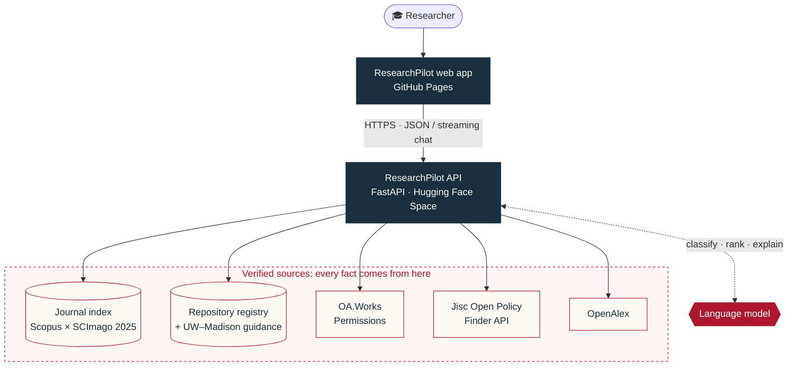

<p align="center">
  <a href="https://mohithnikesh1.github.io/ResearchPilot/">
    
  </a>
</p>

<p align="center">
  <a href="https://mohithnikesh1.github.io/ResearchPilot/"></a>
  
  <a href="https://huggingface.co/spaces/mohithnikesh/ResearchPilot"></a>
  <a href="LICENSE"></a>
</p>

<p align="center">
  
  
  
  
  
</p>

<p align="center">
  <b><a href="https://mohithnikesh1.github.io/ResearchPilot/">Open the app</a></b>
  &nbsp;·&nbsp; <a href="#-what-you-can-do">Features</a>
  &nbsp;·&nbsp; <a href="#-evidence-first-by-design">Evidence-first design</a>
  &nbsp;·&nbsp; <a href="#-how-it-fits-together">Architecture</a>
  &nbsp;·&nbsp; <a href="#-privacy">Privacy</a>
  &nbsp;·&nbsp; <a href="#-sources--attribution">Sources</a>
</p>

<br>

**ResearchPilot** is an independent publishing and research-data assistant for **University of Wisconsin–Madison researchers**. It helps you choose where to publish, understand what you may share, and find a home for your data, and it shows the evidence behind each suggestion. Open it in any browser; there's nothing to install or sign in to.

> [!NOTE]
> ResearchPilot is an independent tool, **not an official UW–Madison or UW–Madison Libraries service**. Its results support decisions; they do not guarantee acceptance, funding eligibility or permission to deposit.

---

## ✨ What you can do

<table>
  <tr>
    <td width="50%" valign="top">
      <h3>📰 Find a journal</h3>
      <p>Browse by <b>subject</b> or paste your <b>title and abstract</b>. ResearchPilot ranks active journals from a verified Scopus × SCImago index of <b>32,050 active titles</b>.</p>
      <ul>
        <li>Explainable <b>fit score</b> out of 100 (not an acceptance probability)</li>
        <li>SJR quartile <b>per subject category</b>, each linked to SCImago</li>
        <li>Indexation status: new, renamed or discontinued titles are flagged</li>
        <li>Recent article evidence from OpenAlex</li>
        <li>Journal website and author-guideline links</li>
        <li>Compare up to five journals · export CSV, BibTeX or RIS · draft a cover letter</li>
      </ul>
    </td>
    <td width="50%" valign="top">
      <h3>🛡️ Share your article</h3>
      <p>Know which version you may share, where, and when.</p>
      <ul>
        <li><b>Have a DOI?</b> Article-level permissions from OA.Works, the data behind cOAlition S's Journal Checker Tool</li>
        <li><b>Only a journal name or ISSN?</b> The journal's record from the Jisc Open Policy Finder API, with each option kept separate</li>
        <li>Checked against your version, deposit location, licence and funder</li>
        <li>Required deposit statements shown word for word</li>
        <li>ShareYourPaper deposit link and MINDS@UW guidance</li>
      </ul>
    </td>
  </tr>
  <tr>
    <td width="50%" valign="top">
      <h3>🗄️ Find a data repository</h3>
      <p>Describe your dataset in two short steps and get matched repositories.</p>
      <ul>
        <li>Chosen from a <b>curated registry of 24 repositories</b>, with reviewed facts</li>
        <li>MINDS@UW and Dryad (UW–Madison membership) offered when your requirements allow</li>
        <li>Checks for DOI, versioning, embargo, licence and size requirements</li>
        <li>Sensitive and personal data triggers explicit review warnings</li>
      </ul>
    </td>
    <td width="50%" valign="top">
      <h3>💬 Chat with ResearchPilot</h3>
      <p>Ask anything about publishing and research data, and get streamed answers.</p>
      <ul>
        <li>Grounded in curated UW–Madison guidance: APC agreements, OA policy, MINDS@UW and RDM support</li>
        <li>Explains metrics, quartiles, FAIR data, embargoes and licences in plain language</li>
        <li>Pulls live Open Policy Finder data for journal-policy questions</li>
        <li>One click takes you into the right tool</li>
      </ul>
    </td>
  </tr>
</table>

---

## 🔍 Evidence-first by design

> **The AI explains. Verified sources decide.**

Language models are good at understanding a manuscript and explaining options, but they are unreliable sources of facts. ResearchPilot keeps the two jobs apart:

| Question | Answered by | What the AI does |
|---|---|---|
| Which journals exist, and their ISSNs, quartiles and index status | Bundled Scopus × SCImago 2025 index (48,888 source records) | Maps your manuscript to a fixed subject list and ranks the verified candidates it is given |
| May I deposit this version, where, and when? | OA.Works Permissions (by DOI) · Jisc Open Policy Finder (by journal) | Writes a short advice note from the retrieved facts only |
| Which repository suits my dataset? | Curated registry with reviewed source links | Picks registry entries and explains the fit |
| Does UW–Madison support my APC? | Curated UW–Madison guidance, reviewed September 2026 | Explains the options; never decides eligibility |

- **Unknown stays unknown.** A missing embargo is never shown as "no embargo", and a missing record is never shown as "not permitted".
- **Policy options stay whole.** One option's licence is never combined with another option's deposit location or timing.
- **No invented links.** Journal and publisher links come from matched metadata or checked publisher pages, never from a guess.
- **Stated limits.** Every result lists which filters were applied and what still needs a manual check.

---

## 🧭 How it fits together



<details>
<summary><b>📁 What's in this repository</b></summary>
<br>

The live site is **one self-contained file** with no build step and no external scripts or fonts:

```text
index.html                 the complete app: inline styles, configuration block,
                           application script, embedded logo and favicon
assets/readme-banner.svg   banner used by this README
LICENSE                    proprietary licence (all rights reserved)
```

`js/`, `css/` and the other files in `assets/` are left over from the earlier multi-file version. `index.html` doesn't load them.

</details>

<details>
<summary><b>⚙️ Configuration</b></summary>
<br>

Every API call uses `apiBase` in the inline configuration block near the end of `index.html`:

```js
window.RESEARCHPILOT_CONFIG = Object.freeze({
  apiBase: "https://mohithnikesh-researchpilot.hf.space",
  model: "gpt-5.6-luna"   // kept for request compatibility; the backend chooses the model
});
```

API keys and other secrets never belong in this repository. They are stored in the Hugging Face Space settings.

</details>

<details>
<summary><b>🚀 Hosting and publishing updates</b></summary>
<br>

The site is served by **GitHub Pages** from the `main` branch (repository root) and calls the live backend at <https://mohithnikesh-researchpilot.hf.space>.

1. Deploy any matching backend change first. Check that [`/api/health`](https://mohithnikesh-researchpilot.hf.space/api/health) reports `version: "3.0.0"` and `ready: true`.
2. Update `index.html` on `main`. GitHub Pages republishes it automatically.
3. If the page is ever served from a different origin, add that origin to `RESEARCHPILOT_ALLOWED_ORIGINS` in the Space settings.

</details>

---

## 🔒 Privacy

> [!IMPORTANT]
> Don't enter confidential manuscripts or identifiable personal or health data.

- Manuscript details, dataset descriptions and chat messages may be sent to **OpenAI** to provide AI assistance.
- **OpenAlex** receives subject keywords, not your unpublished title or abstract.
- Policy checks send only the **DOI or journal identifiers** to the relevant services.
- Usage statistics are **counts only**. Your questions, abstracts and DOIs are never stored for analytics.

---

## 📚 Sources & attribution

| Source | Used for |
|---|---|
| [SCImago Journal & Country Rank](https://www.scimagojr.com) | 2025 SJR metrics and quartiles (© SCImago Lab, based on Scopus® data), used under non-commercial terms with attribution |
| [ShareYourPaper Permissions](https://shareyourpaper.org/permissions) (OA.Works) | Article-level self-archiving permissions |
| [Jisc Open Policy Finder](https://openpolicyfinder.jisc.ac.uk) | Journal-level sharing policies, licensed CC BY-NC-ND 4.0 |
| [OpenAlex](https://openalex.org) | Journal metadata, related works and citation chains |
| [re3data](https://www.re3data.org) | Where to verify repository details |
| [UW–Madison Libraries](https://www.library.wisc.edu/research-support/scholarly-communication/open-access/publishing-support/) | Current APC agreements and publishing support: always confirm eligibility here |

---

<p align="center">
  <b>Built for UW–Madison researchers.</b><br>
  <a href="https://mohithnikesh1.github.io/ResearchPilot/">Open ResearchPilot →</a>
  <br><br>
  <sub>© 2026 Mohith Nikesh. All rights reserved. See <a href="LICENSE">LICENSE</a>.<br>Not affiliated with or endorsed by the University of Wisconsin–Madison.</sub>
</p>
